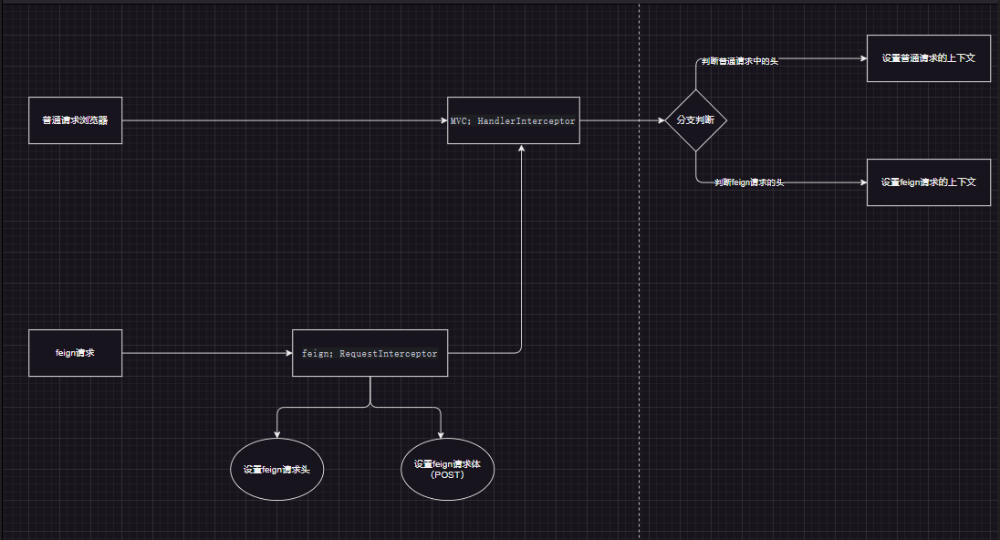

# spring-cloud-alibaba-practice
环境说明：
- springboot3.0
- spring.cloud.alibaba 2022.0.0.0-RC2
- spring.cloud 2022.0.0

# module:custom-openfeign-biz-framework
问题：异步场景下如消息消费，由于之前请求上下文的清理，导致消费逻辑中远程调用的请求头丢失，调用远程服务失败

需求：异步场景下进行远程调用的时候重新设置请求头或者请求体信息，整个业务链条设计如下：

首先是同步调用：
- 同步调用远程服务B：A服务普通请求执行结束，请求上下文被清除，但是清除之前传递给了远程服务B，之后等待B生产消息

然后异步调用
- A消费的时候，生产端B补传必要的请求头信息回来，如租户信息或者工厂信息
- RequestInterceptor：A在feign拦截器中统一设置请求头或者请求体（POST）
- HandlerInterceptor：Common在mvc拦截器中解析feign的请求头或者请求体，并根据请求头重新设置上下文信息：如用户信息，租户信息
- 最后第二次调用远程服务B的其他接口的时候是异步调用，此时异步远程调用服务B才能成功
